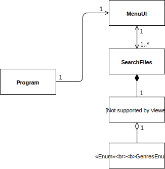

# Projeto 1 - Linguagens de Programação 2

Projeto realizado por:
* [André Pedro](https://github.com/andre-pedro)
* [Diana Nóia](https://github.com/diananoia)
* [Inês Gonçalves](https://github.com/ineesgoncalvees)

## Repartição de Tarefas

* André Pedro: Integração em Unity (descartada posteriormente); Elaboração do Relatório.

* Diana Nóia: 

* Inês Gonçalves: 

## Repositório
O projeto pode ser encontrado neste [repositório](https://github.com/DianaNoia/LP2_Projeto1).

## Arquitetura da solução
Primeiramente é mostrado ao utilizador um Menu onde é pedido um _input_ de 1 a 3, sendo o primeiro para a pesquisa da base de dados, o segundo para créditos e o terceiro para fechar o programa. Ao escrever "1", é-nos pedido para introduzir o que queremos pesquisar. É-nos disponibilizado também os géneros disponíveis. Escrevemos o que queremos pesquisar e clicamos na tecla Enter. Para ler os ficheiros é necessário descomprimi-los, devido a estes estarem no formato `.tsv`. Utilizando o método `GZipReader` da classe "SearchFiles" (baseado no código-exemplo disponibilizado pelo professor), descomprimimos os ficheiros para poderem ser lidos.
O programa corre a base de dados e imprime no ecrã os primeiros 10 resultados. Para ver os próximos 10, é necessário carregar na seta direita. Para ver os anteriores 10, seta do lado esquerdo. Para retornar ao menu principal, clicar no "Backspace".

### Diagrama UML

;

## Referências

* Whitaker, R. B. (2016). The C# Player's Guide (3rd Edition). Starbound Software.

Agradecimento especial aos seguintes alunos: [Tiago Alves](https://github.com/Synpse); [Diogo Maia](https://github.com/IssaMaia); [Pedro Inácio](https://github.com/PmaiWoW);